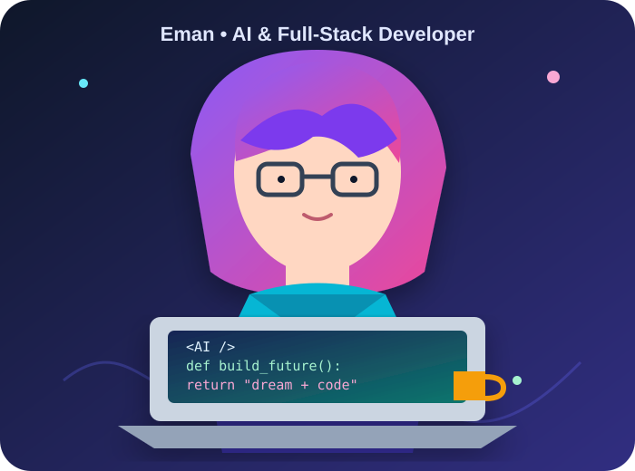

<div align="center">




### 🤖 AI Engineer in the making • 💻 Full-Stack Developer • 🚀 Builder

<a href="https://github.com/Eman2123"></a>
<a href="https://github.com/Eman2123?tab=followers"></a>
<a href="https://github.com/Eman2123?tab=repositories"></a>

</div>

<br/>

<div align="center">


</div>

---

## 🌸 About Me

<table>
<tr>
<td width="58%" valign="top">

I'm **Eman Mirza**, a final-year **BSCS student from Pakistan** who loves building at the intersection of **AI and software engineering**.

I enjoy turning an idea into a working prototype and then pushing it toward a real, usable product.

```python
eman = {
    "focus": ["AI Agents", "LLM Apps", "Automation"],
    "frontend": ["React", "Next.js", "TypeScript"],
    "backend": ["Python", "Node.js", "Laravel", "REST APIs"],
    "databases": ["MySQL", "MongoDB"],
    "goal": "Build useful technology ✨"
}
```

</td>
<td width="42%" valign="top">

### 💫 Right now

🧠 **Learning**

AI agents, modern AI tooling & scalable architectures

🔨 **Building**

AI-powered apps, automation workflows & full-stack products

🏆 **Exploring**

Hackathons, open source & developer communities

💼 **Open to**

Remote internships, collaborations & exciting projects

</td>
</tr>
</table>

---

## 🛠️ Tech Stack

<div align="center">

### 🤖 AI / ML


### 💻 Frontend


### ⚙️ Backend & Database


### 🔧 Tools


</div>

---

## 🚀 Featured Projects

<table>
<tr>
<td width="50%" valign="top">

### 🔧 Repair Shop SaaS

Multi-role management platform for repair businesses with workflows for owners, managers, technicians, drivers and customers.

**Stack:** `Next.js` `TypeScript` `Tailwind`

<a href="https://github.com/Eman2123/repair-saas">🔗 View Project →</a>

</td>
<td width="50%" valign="top">

### 🧠 Bob RepoIQ

AI-powered codebase analyzer that explains software projects in plain English using **watsonx.ai**.

**Stack:** `JavaScript` `watsonx.ai` `AI`

<a href="https://github.com/Eman2123/Bob-RepoIQ">🔗 View Project →</a>

</td>
</tr>
<tr>
<td width="50%" valign="top">

### 🤖 AI Agent Chatbot

Conversational AI system focused on natural-language interaction and task execution.

**Stack:** `Python` `AI` `Automation`

<a href="https://github.com/Eman2123/Ai-Agent-Chatbot-System">🔗 View Project →</a>

</td>
<td width="50%" valign="top">

### 🎙️ AI Voice Assistant

Voice-controlled assistant that listens to commands, processes them and responds through an interactive interface.

**Stack:** `JavaScript` `HTML` `Voice AI`

<a href="https://github.com/Eman2123/AI-Voice-Assistance">🔗 View Project →</a>

</td>
</tr>
</table>

---

## 🏆 Build • Break • Learn • Repeat

<div align="center">

I enjoy **hackathons, rapid prototyping and experimenting with new AI platforms**.

My goal is simple: **build software that solves real problems — not just demos that look good.**

`AI Agents` · `Automation` · `Full Stack` · `Developer Tools` · `Open Source`

</div>

---

## 📊 GitHub Analytics

<div align="center">


<br/><br/>


</div>

---

## 🌐 Let's Connect

<div align="center">

<a href="mailto:mirzaeman942@gmail.com"></a>
<a href="https://www.linkedin.com/in/eman-mirza-926035249/"></a>
<a href="https://discord.com/users/eman_12137"></a>
<a href="https://github.com/Eman2123"></a>

<br/><br/>

### ✨ Thanks for stopping by!

**Let's build something amazing. 🚀**


</div>
