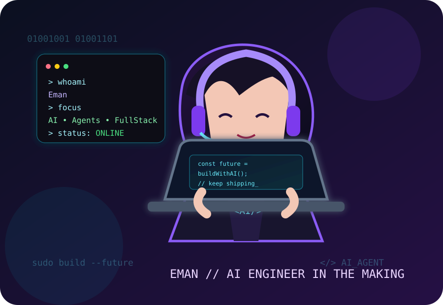

<div align="center">




### 🖤 AI Engineer in the making • 💻 Full-Stack Developer • ⚡ Builder

<a href="https://github.com/Eman2123"></a>
<a href="https://github.com/Eman2123?tab=followers"></a>
<a href="https://github.com/Eman2123?tab=repositories"></a>

</div>

<br/>

<div align="center">


</div>

---

## 🕶️ About Me

<table>
<tr>
<td width="58%" valign="top">

I'm **Eman Mirza**, a final-year **BSCS student from Pakistan** who loves building at the intersection of **AI and software engineering**.

I enjoy turning an idea into a working prototype and then pushing it toward a real, usable product.

```python
eman = {
    "focus": ["AI Agents", "LLM Apps", "Automation"],
    "frontend": ["React", "Next.js", "TypeScript"],
    "backend": ["Python", "Node.js", "Laravel", "REST APIs"],
    "databases": ["MySQL", "MongoDB"],
    "mode": "build > break > debug > repeat"
}
```

</td>
<td width="42%" valign="top">

### ⚡ Current Mission

🧠 **Learning**
## 👩‍💻 About Me

- 🔭 Currently building a **Repair Shop Management SaaS** — multi-role platform with Next.js 14
- 💻 Full Stack Developer with strong focus on **Backend & Python**
- 🐍 Python is my primary language — AI agents, automation, chatbots
- 🌱 Always exploring new things in **AI, APIs & scalable architecture**
- 🤝 Open to collaborating on full stack or AI-powered projects
- 📫 Reach me: **mirzaeman942@gmail.com**

---

## 🛠️ Tech Stack

**Languages**


**Frontend**


**Backend & APIs**


**Databases**


**Cloud & DevOps**


**AI / ML**


**Cybersecurity**


**Tools & Platforms**


---

## 🚀 Featured Projects

<table>
  <tr>
    <td width="50%">
      <h3 align="center">🔧 Repair Shop SaaS</h3>
      <p align="center">
        <a href="https://github.com/Eman2123/repair-saas">
          
        </a>
      </p>
      <p align="center">Multi-role repair shop management platform with owner, manager, technician, driver & customer portals</p>
      <p align="center">
        
        
        
      </p>
    </td>
    <td width="50%">
      <h3 align="center">🤖 AI Voice Assistant</h3>
      <p align="center">
        <a href="https://github.com/Eman2123/AI-Voice-Assistance">
          
        </a>
      </p>
      <p align="center">Voice-controlled intelligent virtual assistant that listens, understands, and responds to spoken commands</p>
      <p align="center">
        
        
      </p>
    </td>
  </tr>
  <tr>
    <td width="50%">
      <h3 align="center">💬 AI Agent Chatbot System</h3>
      <p align="center">
        <a href="https://github.com/Eman2123/Ai-Agent-Chatbot-System">
          
        </a>
      </p>
      <p align="center">Intelligent chatbot system with natural conversation capabilities and task automation</p>
      <p align="center">
        
      </p>
    </td>
    <td width="50%">
      <h3 align="center">🍽️ Restaurant Management</h3>
      <p align="center">
        <a href="https://github.com/Eman2123/Restaurant-Management-System">
          
        </a>
      </p>
      <p align="center">Laravel-based restaurant system managing menu, orders & sales via admin dashboard</p>
      <p align="center">
        
        
      </p>
    </td>
  </tr>
  <tr>
    <td width="50%">
      <h3 align="center">🧠 Bob RepoIQ</h3>
      <p align="center">
        <a href="https://github.com/Eman2123/Bob-RepoIQ">
          
        </a>
      </p>
      <p align="center">AI-powered codebase analyzer that translates code into plain English for business owners using watsonx.ai</p>
      <p align="center">
        
        
      </p>
    </td>
    <td width="50%">
      <h3 align="center">🤖 AI Agent Chatbot v1</h3>
      <p align="center">
        <a href="https://github.com/Eman2123/AI-Agent-Chatbot">
          
        </a>
      </p>
      <p align="center">First version of the AI assistant — conversational agent with task execution capabilities</p>
      <p align="center">
        
        
      </p>
    </td>
  </tr>
</table>

---

## 📊 GitHub Stats

<div align="center">


</div>

---

## 🐍 Contribution Game

<div align="center">

### Your contributions are the path. The snake is hungry. 🐍


</div>

---

## 📊 GitHub Analytics

<div align="center">


</div>

---

## 🌐 Connect With Me

<div align="center">

[](mailto:mirzaeman942@gmail.com)
[](https://www.linkedin.com/in/eman-mirza-926035249/)
[](https://discord.com/users/eman_12137)
[](https://github.com/Eman2123)

### ✨ Thanks for stopping by!

**Keep coding. Keep building. Keep shipping. 🚀**


<div align="center">

</div>
